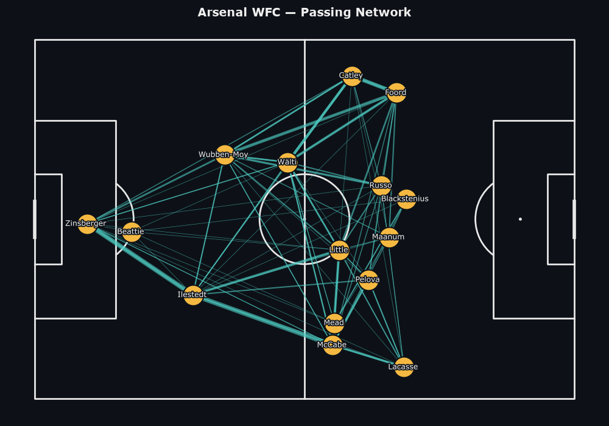
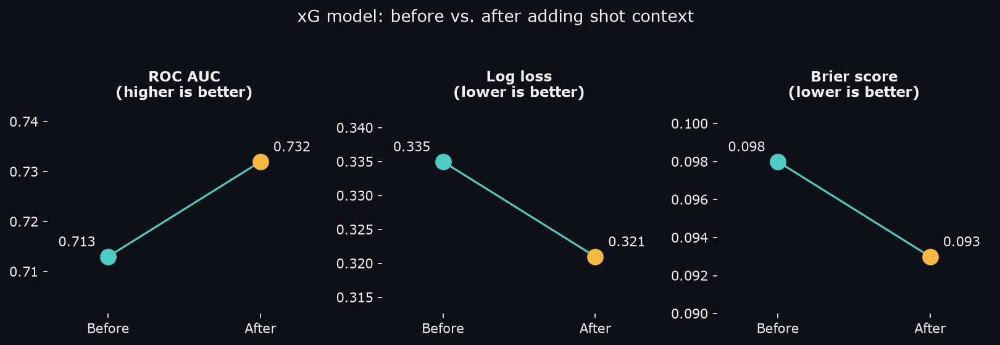
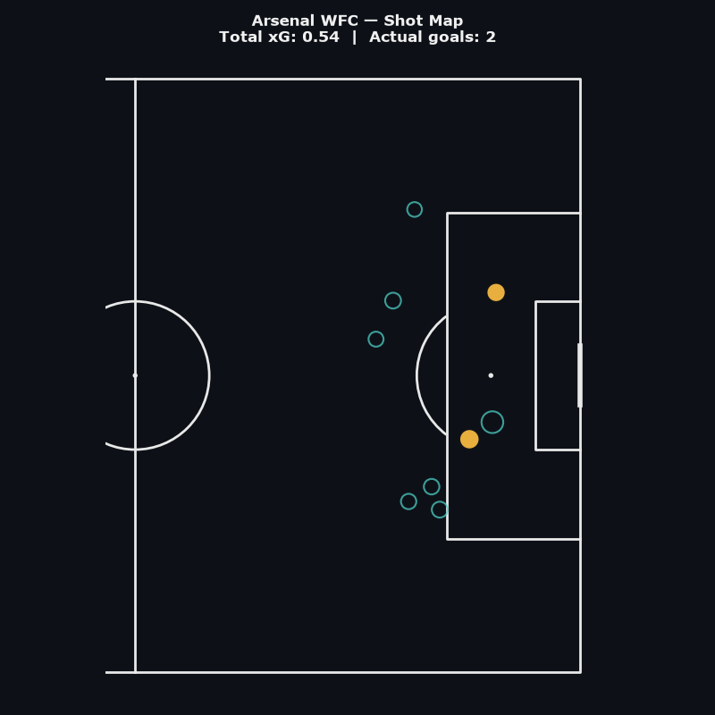
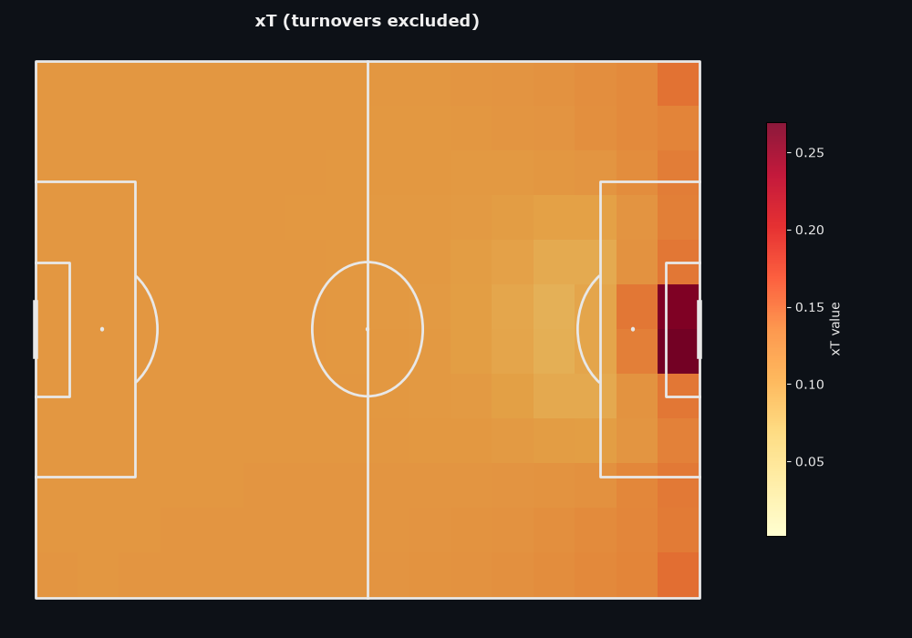
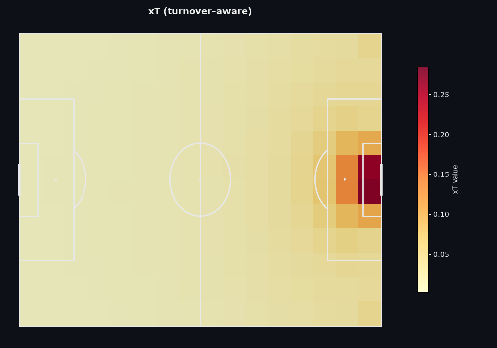
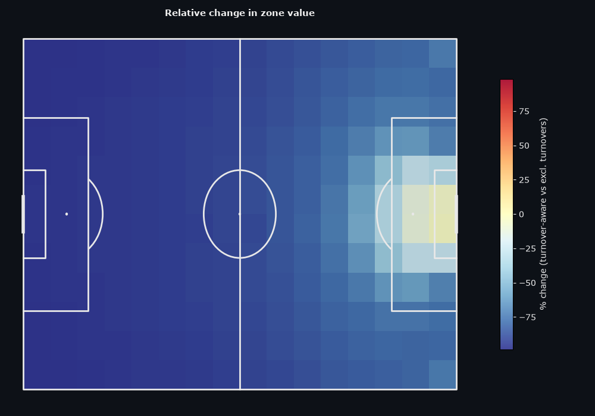
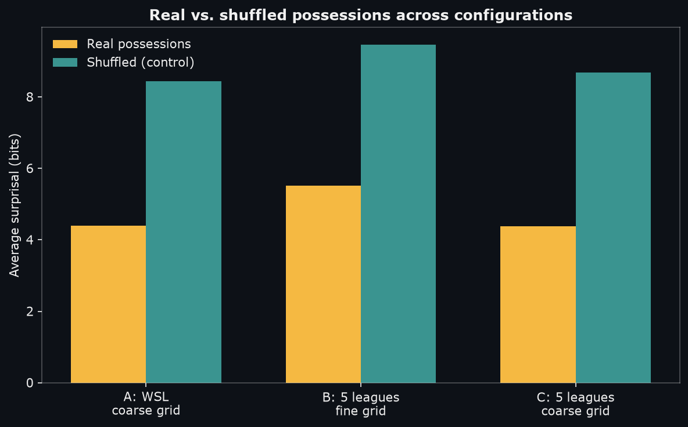
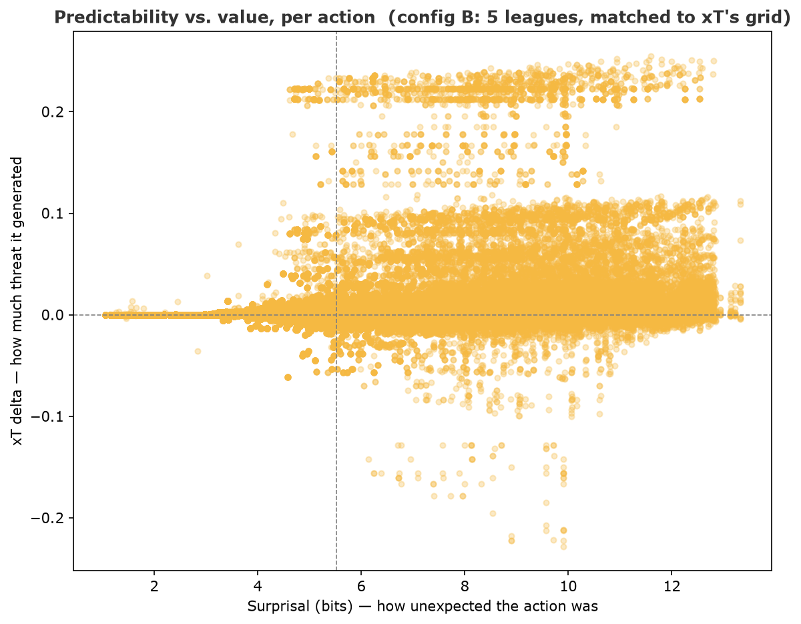

# Football Intelligence Copilot

A machine learning and statistical modeling platform for tactical football analysis — turning raw match event data into the kind of tools an analyst or coach could actually use: pass networks, shot maps, and two models of "how dangerous is this passage of play," approached from two different directions.

A note on the name: "Copilot" reflects the project's intended end-state — a natural-language interface over these models — which is scoped in "What I'd build next" below but not yet built. Everything in this repo today is classical ML and statistical modeling (logistic regression, Markov chain transition models), not an LLM-based system — a deliberate choice, given both interpretability and the difficulty of assembling the kind of data needed to train or fine-tune a football-specific language model.

Built end-to-end on [StatsBomb's free open data](https://github.com/statsbomb/open-data)
(FA Women's Super League, 2018/19–2023/24), from raw event ingestion through model training,
validation, and API serving.

## Why this project

Football clubs face a familiar problem for any data-rich organisation: plenty of raw data,
not enough tooling that turns it into decisions. This project is a small, data-poor version of
that pipeline — not an attempt to replicate commercial analytics platforms, but a demonstration
of the full path from raw event data to a validated model to a served, queryable result, plus a
new way of looking at football analysis.

## Architecture

```
  StatsBomb Open Data
        │
        ▼
  Ingestion (src/ingestion/) — normalizes raw events, caches as Parquet
        │
        ▼
  Analytics (src/analytics/) — xG, xT, and sequence models
        │
        ▼
  Training pipelines (scripts/) — offline fitting, saved model artifacts
        │
        ▼
  Visualisation (src/visualisation/) — pitch plots, heatmaps
        │
        ▼
  API (src/api/) — FastAPI service, models loaded once at startup
```

Analytics functions are pure and reusable; training/data-pipeline code is kept separate from
inference code, so the API loads pre-trained artifacts rather than retraining on every request.

## Models

This project builds three ways of asking "what made this passage of play dangerous," starting
with the most familiar (a single shot's chance of scoring), moving to something broader (how
much did this pass or carry change the team's danger, even without a shot), and finishing with
something different in kind: not how valuable was this action, but how expected was it,
borrowed from how language models measure the predictability of a sentence.

### Team structure: passing networks

Before any predictive model, the simplest useful question is descriptive: how did a team
actually build its play? Node position is each player's average location on the ball; edge
width is how often two players combined.



Reading this match's network: Little sits centrally as the team's structural pivot, with the
highest connectivity on the pitch, while the right side (Foord, Catley, Russo) shows denser
combination play than the left — suggesting Arsenal favoured progression through the right
half-space in this fixture.

*Known simplification: the network is computed across the full match rather than cut at the
first substitution, so a substitute's average position reflects only their partial minutes on
the pitch.*

### xG — Expected Goals

#### The idea
Not every shot is equally likely to score. A tap-in from six yards and a speculative strike
from 30 yards are both just "shots" in a basic stat sheet — xG assigns each one a probability
of scoring, learned from thousands of real shots with similar characteristics.

#### What it uses
A shot's distance and angle to goal are the two strongest, most intuitive predictors — closer
and more central shots score more often. On top of that geometric baseline, this model adds
four pieces of context StatsBomb records for every shot: whether it was a header, a direct
free kick, taken under defensive pressure, or hit first-time. Penalties are handled separately,
since their distance and angle are fixed and uninformative — they're assigned their own
empirically-measured conversion rate (74.3%) rather than being forced through the geometric
model.

#### Results
Trained on ~30,000 shots, validated on matches the model never saw during training (an
important discipline — shots from the same match were never split across training and
testing, since that would let the model "peek" at context it shouldn't have).



Adding shot context improved every metric: ROC AUC rose from 0.713 to 0.732 (how well the
model ranks genuinely dangerous shots above weaker ones), while log loss and Brier score both
fell (how well its probabilities are calibrated — a shot rated 30% likely to score should
actually go in about 30% of the time). The coefficients also make football sense: headers and
shots taken under pressure both reduce scoring probability, matching what any regular viewer of
football would expect — worth checking before trusting a model's numbers, not just assuming it.

Applied to a real match:



Marker size reflects predicted xG, colour reflects actual outcome. In this match Arsenal scored
2 goals from a combined 0.74 xG — an overperformance worth noting rather than treating as a
modelling error. It reflects finishing quality above the underlying chance quality created,
which is exactly the distinction an xG baseline exists to surface.

#### Limitations
Distance and angle capture geometry, not what's actually in the way — a shot with a covered
goal and a shot with an open one, from the same spot, get the same score today. StatsBomb does
provide freeze-frame defender positions for shots specifically, which would be the natural next
feature to add.

### xT — Expected Threat

#### The idea
xG only values shots. But a team can build a dangerous attack through ten passes that never end
in a shot on target — xG has nothing to say about those passes. Expected Threat, introduced by
[Karun Singh (2018)](https://karun.in/blog/expected-threat.html), values every action by
asking: if a team has the ball in this exact area of the pitch, how likely are they to
eventually score?

#### How it works
The pitch is split into a grid of zones. Each zone gets a value combining two things: how
likely a shot from there is to score, and how valuable the zones a team's passes and carries
from there typically lead to. Because those two things depend on each other — a zone's value
depends on its neighbours' values, which depend on their neighbours' — there's no way to
compute it directly. Instead, the model starts by assuming every zone is worth nothing, then
repeatedly recalculates every zone's value using the previous round's answers, letting value
"flow backward" from the goal across the whole grid. After around 150 rounds the numbers stop
changing meaningfully — the same basic technique Google's original PageRank used to rank web
pages by ranking the pages that link to them.

<p align="center">
        
        <br><em>Naive version: only shots and completed passes counted, implicitly assuming possession is never lost.</em>
</p>

<p align="center">
        
        <br><em>Turnover-aware version: losing the ball is now modelled explicitly as a possible outcome of every zone.</em>
</p>

<p align="center">
        
        <br><em>The relative change between the two versions — the chart that actually confirms the finding below.</em>
</p>

A finding worth calling out: the naive version only counted shots and completed passes when
computing each zone's statistics — implicitly assuming the ball is never lost. Testing that
assumption directly (comparing how often actions are actually completed, zone by zone) showed
it wasn't a safe one: the naive model overvalued deep buildup zones by roughly 80-90% relative
to zones near goal, simply because it never accounted for how often possession breaks down in
deeper areas. Modelling turnovers explicitly — even with the simplest possible assumption, that
losing the ball has zero further value — corrected this substantially.

Note: this grid was later rebuilt using the corrected xG model above, and the overall value
range compressed as a result (from roughly 0.0002–0.28 down to 0.09–0.27). That's expected, not
a regression — the earlier xG bug had been overvaluing headers, which inflated near-goal zones;
the corrected version still concentrates its highest values centrally, right inside the box,
exactly where football intuition says they should be.

#### Limitations
`turnover_value = 0` still treats losing the ball as equally costless everywhere, when losing
it in your own third is far more dangerous than losing it near the opponent's goal. A more
complete version would credit turnovers with a negative value based on the opponent's own
threat from wherever the ball was lost — scoped, but not yet built. The model also doesn't
account for substitutions, computing one average position per player across their full time on
the pitch rather than splitting before/after a substitution.

### Experimental: Surprisal & Perplexity

xG and xT both answer a version of the same question: how much is this action worth? This
section asks a different one: how expected was it, given the patterns present in real match
play — not value, but predictability.

#### Why sequence, not space
Football is played as a sequence of decisions, each shaped by what just happened — structurally
the same as a sentence, where each word depends on the words before it. This section borrows
directly from how language models are evaluated: a possession is treated as a sequence of
tokens (what kind of action, in what part of the pitch), and a model learns how often one token
typically follows another. It's the same transition-probability idea already built for xT,
repurposed to ask a different question.

The per-action metric uses the actual term from information theory for this exact quantity:
surprisal — the negative log-probability of an observed event (Shannon, 1948). The
per-possession aggregate is perplexity, the standard measure of how well a language model
predicts real text, applied here to football instead.

#### A non-spatial metric
The reason this complements value, rather than duplicating it: a possession pattern can be
predictable and effective (a well-drilled, low-risk build-up), predictable and pointless
(aimless sideways recycling, directly observed in this project's own xT debugging), surprising
and effective (real individual skill, or a disguised pattern breaking a defence), or surprising
and costly (overambition that gives the ball away). Value-based models like xT can't tell these
apart, since they only score value. Predictability is the missing second dimension, and works
as an orthogonal metric to spatial ones like xG or xT.

The image below validates the approach. A model that's learned nothing real should be equally
"surprised" by real football and by the same actions in random order. It isn't:

<p align="center">
        
</p>

Real possessions consistently score lower average surprisal than their shuffled counterparts —
direct confirmation the model has learned genuine structure in how football is actually played,
not just noise, before any of its output is trusted for analysis.

What it actually shows. Cross-referencing each action's surprisal against its xT value reveals
a specific, non-obvious shape:

<p align="center">
        
</p>

Predictable actions cluster tightly around zero added value — both low-risk and low-reward.
Unpredictable actions spread much further in both directions. Predictability caps both the
ceiling and the floor of an action's value — a more precise and more useful finding than
"surprising actions are more valuable" alone, which the data only weakly supports (correlation
≈ 0.20). The real relationship is about variance, not average value.

Three sparsity problems, found and fixed in sequence:

1. **Unseen-transition ties.** Never-observed transitions from a common context all score
   identically, regardless of how unusual the real outcome was — a mathematical side effect of
   the smoothing needed to keep the model well-defined. Fixed by filtering to transitions that
   were actually observed at least once.
2. **Thin-context inflation.** Contexts with few total observations — goalkeeper passes, by
   volume — get artificially inflated surprisal, since a small denominator lets the smoothing
   term dominate. This surfaced as several real goalkeepers unexpectedly topping the "most
   surprising actions" list, for reasons that had nothing to do with genuine unpredictability.
   Fixed by requiring a minimum number of observations behind every scored context.
3. **Remaining tie-breaking limitation.** Among genuinely rare transitions from an identical,
   common context, several different real destinations can still score identically, since the
   current formula depends only on how often something happened, not how far the actual outcome
   deviated from what's typical. A complete fix would add a secondary, geometric measure of
   deviation.

Two configurations were compared before settling on a final one, to isolate which lever (grid
resolution or data volume) actually addressed the sparsity problem, rather than changing both
at once and guessing: a coarser zone grid controls vocabulary size directly, while pooling five
leagues (1,132 matches total) increases how many contexts are well-observed. Both helped,
independently and combined.

## Setup

```bash
pyenv virtualenv 3.12.11 football-intelligence
pyenv local football-intelligence
pip install -r requirements.txt
```

## Running the pipelines

```bash
# train the xG model (pulls + caches WSL event data, trains, validates, saves artifact)
python -m scripts.train_xg_model

# build the xT grid (requires the trained xG model)
python -m scripts.build_xt_grid

# run the API
uvicorn src.api.main:app --reload
# interactive docs: http://127.0.0.1:8000/docs
```

## Project structure

```
├── data/               # cached raw + processed event data (gitignored)
├── models/             # trained xG model, xT grid
├── notebooks/          # exploratory analysis
├── scripts/            # one-off training/build pipelines
├── src/
│   ├── ingestion/      # StatsBomb loading + normalization + caching
│   ├── analytics/      # progressive passes, xG, xT
│   ├── visualisation/  # pass networks, shot maps, xT heatmaps
│   └── api/            # FastAPI service
└── tests/
```

## What I'd build next

- A natural-language interface over these models — the actual "Copilot" layer implied by the
  project's name. Concretely: an endpoint that packages already-computed stats (pass network
  summary, shot map totals, xT/surprisal highlights) into a prompt and returns an analyst-style
  natural-language summary via an LLM API. Deliberately scoped last, since it's only as good as
  the analytics underneath it — the models above are the actual substance; the LLM layer is an
  interface on top, not a replacement for them.
- Opponent-aware xT: a negative turnover value based on the opposing team's own threat surface
- Per-team xT surfaces, to capture tactical identity rather than one blended league average
- Freeze-frame defender positions as an xG feature, using StatsBomb's shot-level freeze frames
- A geometric tie-breaker for surprisal, so genuinely rare transitions rank by how unusual they
  were, not only by how rarely they occurred
- A minimal frontend for browsing matches interactively, rather than querying the API directly

## Data & attribution

Match event data provided free by [StatsBomb](https://statsbomb.com/) via their open data
repository, used under their open data license. Analysis and models are original work built
on top of that data.
